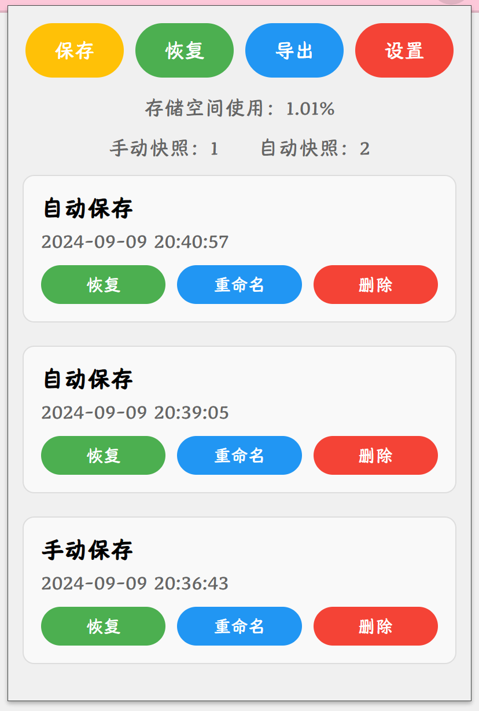

# TabVault

TabVault 是一款面向 Chrome 浏览器的标签页快照管理扩展，帮助你随时保存、恢复和归档所有打开的窗口与标签页。无论是备份当前的工作集，还是在不同任务之间快速切换，TabVault 都能让浏览更有条理。

## 预览

### 弹出面板

### 选项页面

## 功能亮点

- **一键手动快照**：即时保存所有当前窗口与标签页，形成可随时恢复的工作集。
- **自动定时备份**：按照自定义间隔自动创建快照，防止重要会话意外丢失。
- **原样恢复**：完整还原保存时的窗口布局与标签页顺序。
- **批量管理**：支持重命名、删除、导出快照，轻松整理浏览记录。
- **书签导出**：将快照内容导出为通用 HTML 书签文件，便于归档或分享。

## 安装

1. 克隆或下载本仓库。
2. 打开 Chrome 并访问 chrome://extensions/。
3. 在右上角开启 “开发者模式”。
4. 点击 “加载已解压的扩展程序”，选择项目根目录。
5. 安装完成后即可在工具栏找到 TabVault 图标。

## 使用说明

- 点击工具栏上的 TabVault 图标打开弹出面板。
- 通过 **“保存”** 按钮手动创建快照，或在选项页启用自动保存。
- 在快照卡片中点击 **“恢复”** 即可还原对应的窗口与标签页。
- 使用 **“重命名 / 删除”** 管理快照，或选择 **“导出”** 生成书签文件。
- 在选项页可设置自动保存间隔、自动快照保留数量等偏好。

## 开发与调试

- 项目基于原生 Chrome 扩展 API，主要使用 JavaScript、HTML、CSS 实现。
- 代码结构：
  - manifest.json：扩展配置入口。
  - background.js：后台任务、自动快照调度与消息分发。
  - popup.*：弹出面板界面及交互逻辑。
  - options.*：选项页配置界面。
  - db.js：IndexedDB 封装与数据持久化。
  - shared.css：全局样式和 UI 组件。
- 修改代码后，可在扩展管理页点击 “重新加载” 来替换当前版本。

## 规划路线图

- [ ] 支持快照搜索与筛选。
- [ ] 快照分组与标签管理。
- [ ] 多设备同步能力。
- [ ] 备份完成通知提醒。

欢迎通过 Issue 提交你的想法或需求。

## 注意
- 项目仍在积极开发中，可能存在尚未覆盖的 bug 与边缘场景。
- 欢迎通过 Issue 或 PR 反馈问题、提出改进建议，一起让 TabVault 变得更好。

## 致谢

~~本项目在早期开发中使用 Cursor 协助生成代码和界面。~~
感谢 GPT-5 Codex 在持续开发、调试与文档整理过程中提供的支持。

## 许可证

本项目采用 [MIT License](LICENSE)，欢迎在遵循许可证的前提下自由修改与分发。

